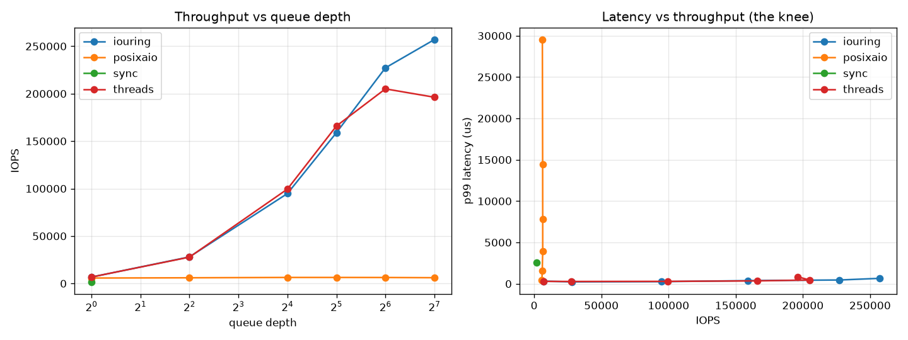

# Demo 2 · Async I/O Engine Benchmark (io_uring vs libaio-style vs threads)

**What it shows:** the core claim of [`kb/02`](../../kb/02-async-io-iouring-libaio.md) —
that **io_uring** scales I/O throughput on few cores with low tail latency, while
**POSIX AIO** (glibc thread-pool emulation) doesn't, and **thread-per-I/O** scales
but pays context-switch tax at high concurrency. It also draws the
**throughput-vs-latency knee** from [`kb/09`](../../kb/09-performance-tuning-fio-spdk.md).

The io_uring engine is implemented with **raw syscalls** against the kernel uapi
header `<linux/io_uring.h>` (mmap'd SQ/CQ rings, doorbell via `io_uring_enter`) —
**no liburing dependency** — so it doubles as a readable reference for the ring
architecture you'll be asked to explain.

## Example result (`--direct`, ext4 on NVMe, 4 KiB random reads)

```
   engine   qd       IOPS      p99_us
     sync    1      1,759     2565     <- QD1: pure device latency
  threads   64    205,054      453     <- scales, but tail grows; regresses at QD128
 posixaio   64      6,317    14452     <- glibc AIO = thread pool: does NOT scale, tail explodes
  iouring  128    256,994      655     <- highest IOPS, controlled tail  ✅
```



Talking points this hands you:
- **posixaio flatlines at ~6k IOPS** no matter the queue depth — concrete proof of the
  KB 02 claim that glibc POSIX AIO is thread-pool emulation, not real async I/O.
- **threads** reach high IOPS but tail latency balloons and throughput *regresses* past
  the core count (context switches, cache thrash).
- **io_uring** gets the most IOPS per core with the best-controlled p99 — batched
  submission + shared rings + no per-op thread.
- The **QD sweep** is the latency/throughput knee (Little's Law): find the QD just
  below where p99 explodes.

## Run it

```bash
make                     # builds ./iobench (auto-detects io_uring)
python3 bench.py         # buffered sweep (measures framework + page cache)
python3 bench.py --direct --plot sweep.png   # O_DIRECT: real device numbers
python3 bench.py --engines iouring threads --qds 1 8 32 128 --direct

# single run, raw:
./iobench --file /tmp/iobench.dat --engine iouring --qd 32 --bs 4096 --ios 100000 --direct
```

Engines: `sync`, `threads`, `posixaio` (all cross-platform: Linux + macOS),
`iouring` (Linux only; auto-skipped on macOS).

## Methodology notes (say these; they show maturity — kb/09)

- **Use `--direct`** for device numbers. Without it you measure the **page cache +
  framework overhead** (reads hit RAM; io_uring may even punt cached reads to async
  workers, making it *slower* than a plain `pread` — a great nuance to mention).
- The scratch file lives on your real filesystem; for true device characterization use
  a dedicated scratch device and **precondition** an SSD to steady state (SLC cache /
  GC — kb/05).
- Report **p99/p99.9**, not just average. Sweep **queue depth** to find the knee.
- Compare to `fio` (`fio --name=t --ioengine=io_uring --direct=1 --rw=randread --bs=4k
  --iodepth=32 --numjobs=4 --runtime=60 --time_based`) — this demo mirrors what fio does.

## Files
- `iobench.c` — the benchmark; `run_iouring()` is a compact raw-io_uring reference
- `Makefile` — auto-detects io_uring; links `-lpthread -lrt`
- `bench.py` — build + QD sweep + CSV + knee-curve plot
- `sweep_direct.png`, `results_direct.csv` — example artifacts from a real run

> Portability: builds with any C99 compiler. On macOS you get sync/threads/posixaio.
> On Windows, use WSL. Disable io_uring with `make CFLAGS=-DNO_IOURING` if your headers
> predate it.
